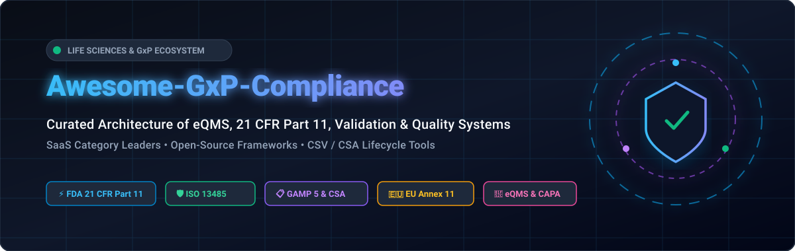
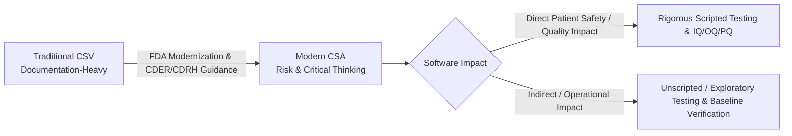

# 🛡️ Awesome-GxP-Compliance

  
  
  
  
  
  
  

  

# 🌐 Top GxP Compliance Platforms & Open-Source Quality Systems Ecosystem
**Curated Architecture of SaaS eQMS Platforms, Open-Source Repositories, CSV/CSA Toolkits & Life Sciences Quality Systems**  
*Focused on 21 CFR Part 11, EU Annex 11, ISO 13485, ISO 14971, GAMP 5, CAPA, Document Control, Validation, and ALCOA+ Audit Trails*  
📅 **Last updated:** August 2026

---

## 📖 Overview & SEO Guide

**GxP** (Good *Practice* — encompassing GMP, GCP, GLP, GVP, and GDP) represents the global regulatory quality standards enforced by the **FDA**, **EMA**, **MHRA**, **Health Canada**, and **PMDA** for pharmaceuticals, biotechnology, medical devices, and digital health (SaMD).

This repository is an SEO-optimized knowledge graph tracking leading **commercial SaaS eQMS platforms**, **electronic validation lifecycle systems (VLMS)**, **Laboratory Information Management Systems (LIMS)**, and **validated open-source compliance building blocks**.

### 🔑 Key Regulatory Frameworks Covered
* 🏛️ **FDA 21 CFR Part 11**: Electronic Records & Electronic Signatures (ERES), predicate rules, and audit trail integrity.
* 🇪🇺 **EU GMP Annex 11 / Chapter 4**: Computerised systems and data integrity requirements in the European Union.
* 🩺 **ISO 13485:2016 & ISO 14971:2019**: Medical devices quality management systems & risk management.
* 📐 **GAMP 5 (Second Edition) & FDA CSA**: Computer Software Assurance risk-based validation frameworks.
* 🔒 **ALCOA+ Data Integrity**: Attributable, Legible, Contemporaneous, Original, Accurate, + Complete, Consistent, Enduring, and Available.

---

## 📑 Table of Contents
* [☁️ SaaS/Hosted eQMS Platforms](#️-saashosted-eqms-platforms)
* [💻 Open-Source GitHub Projects](#-open-source-github-projects)
* [📚 GxP & Validation Cheat Sheet (CSV vs. CSA)](#-gxp--validation-cheat-sheet-csv-vs-csa)
* [🤝 How to Contribute](#-how-to-contribute)
* [📈 Star History](#-star-history)
* [⚖️ Disclaimer](#️-disclaimer)

---

## ☁️ SaaS/Hosted eQMS Platforms

> 📊 **Market Size & Structure**: The global Life Sciences Quality Management Software (eQMS & GxP Compliance) market is estimated at **$3.8 Billion to $5.2 Billion in 2026** (projected to surpass **$8.5 Billion by 2030 at ~12.8% CAGR**). The sector is **moderately concentrated at the enterprise tier** (dominated by multi-billion-dollar conglomerates like Honeywell/Sparta TrackWise and Hexagon/ETQ Reliance, alongside established unicorns like MasterControl), while being **moderately fragmented in the mid-market and SMB segments** where specialized, cloud-native platforms (Qualio, Greenlight Guru, Scilife, Dot Compliance) compete for medical device, biotech, and digital health scale-ups.

*The table below is sorted by **Company Scale (Revenue / Valuation / Market Cap)** in descending order:*

| 🏢 Platform | 💰 Company Scale (Revenue / Valuation) | 🎯 Core Focus & GxP Capabilities | 🏷️ Pricing (Starting Tier) | ⏱️ Free Tier / Free Trial Limits |
| :--- | :--- | :--- | :--- | :--- |
| **[Sparta TrackWise (PTC / Honeywell)](https://www.ptc.com/)** | **~$38.5B** Parent Revenue / **$1.3B** Acquisition (PTC Market Cap **~$22B**) | Enterprise QMS and quality event management suite for global pharmaceutical manufacturing, deviations, CAPA, and change control. | Starts at **$200/user/month** (~$25,000–$50,000/year minimum contract threshold for TrackWise Digital). | **No self-serve free trial or free tier**; evaluation strictly via custom enterprise architectural review and guided proof-of-concept. |
| **[ETQ Reliance (Hexagon)](https://www.etq.com/)** | **~$5.6B** Parent Revenue / **$1.2B** Acquisition | Highly configurable enterprise QMS supporting ISO 13485, GMP audits, supplier management, and enterprise risk. | Starts at **$2,083/month** (~$25,000/year entry tier based on concurrent user [CCU] licensing and selected core modules). | **30-day proof-of-value (PoV) sandbox** for qualified enterprise buyers upon vendor scoping; no permanent free plan. |
| **[MasterControl](https://www.mastercontrol.com/)** | **~$200M+ ARR** / **$1.3B** Valuation (Series A Unicorn) | Integrated Quality Management (Qx) & Manufacturing Execution System (Mx/EBR) for FDA-regulated pharma and medtech. | Starts at **$2,083/month** (~$25,000/year base tier for named-user package configurations). | **No free trial or free forever plan**; evaluation provided strictly via scheduled technical walkthrough and sandboxed enterprise PoC. |
| **[Greenlight Guru](https://www.greenlight.guru/)** | **~$25M–$35M ARR** / **$120M+** Funding (~$500M+ Valuation) | MedTech-specific eQMS aligned with FDA 21 CFR Part 820, ISO 13485:2016, design history files (DHF), and risk management. | Starts at **$2,083/month** (~$25,000/year base package for early-stage MedTech startups). | **No self-serve free trial or free tier**; evaluation available via interactive product tour and guided prototype evaluation sandbox. |
| **[Kneat (Kneat Gx)](https://kneat.com/)** | **~$38M CAD ARR** / **~$280M CAD** Public Market Cap (TSX: KSI) | Paperless GxP validation lifecycle management software for authoring, approving, and executing electronic validation protocols. | Starts at **$2,900/month** (~$35,000/year base tier depending on user license count and deployment scope). | **No free forever plan or public self-serve trial**; evaluation provided through scheduled live interactive demo and tailored sandbox walkthrough. |
| **[ValGenesis](https://www.valgenesis.com/)** | **~$45M–$60M ARR** / **$100M+** Growth Equity (Morgan Stanley) | Corporate electronic Validation Lifecycle Management System (iVLMS) covering Computer System Validation (CSV/CSA), cleaning, and equipment. | Starts at **$2,500/month** (~$30,000/year base subscription for entry validation lifecycle modules). | **No open self-service free trial or free tier**; evaluation via guided technical demo and scoped pilot validation workshops. |
| **[Qualio](https://www.qualio.com/)** | **~$22M–$30M ARR** / **$63M+** Funding (~$150M–$250M Valuation) | Cloud-native eQMS built for emerging and growth life sciences (biotech, therapeutics, medical devices) covering CAPA, training, and docs. | Starts at **$1,000/month** ($12,000/year billed annually for Growth tier). | **No free trial for core eQMS** (companion QualiHQ tier offers free starter for up to 5 users/basic document sharing; guided demo for main eQMS). |
| **[ComplianceQuest](https://www.compliancequest.com/)** | **~$25M–$35M ARR** / **$50M+** Funding (Salesforce Ventures) | Salesforce-native enterprise QMS, EHS, supplier quality, and product lifecycle compliance platform with pre-built validation packages. | Starts at **$30/user/month** (~$10,000–$15,000/year minimum commitment depending on modules). | **30-day sandbox trial** available on Salesforce AppExchange for up to 5 test users; no permanent free plan. |
| **[Dot Compliance](https://www.dotcompliance.com/)** | **~$17.6M ARR** / **$33M+** Funding | AI-driven, ready-to-deploy eQMS built natively on Salesforce with pre-configured 21 CFR Part 11 workflows and validation kits. | Starts at **$1,667/month** (~$20,000/year base tier for standard life sciences starter package). | **14-day guided validation pilot** upon qualification; no open self-service free trial or free tier. |
| **[Scilife](https://www.scilife.io/)** | **~$10M–$15M ARR** / Growth-Stage | Modern smart quality platform for life sciences providing document control, CAPA, change control, training, and audit management. | Starts at **$1,000/month** (~$9,000–$12,000/year base for Essential tier). | **14-day free trial** with access to core workspace and up to 5 user invites; no permanent free plan. |

---

## 💻 Open-Source GitHub Projects

> 💡 **Open-Source in Regulated Environments**: Fully validated production eQMS platforms are concentrated in commercial SaaS due to the ongoing regulatory Computer Software Assurance (CSA) validation burden. However, exceptional open-source building blocks exist for electronic lab notebooks, LIMS, audit trails, and document control frameworks.

*The table below is sorted by **GitHub Stars** in descending order:*

| 📦 Repository & Stargazers Badge | ⭐ Stars | 🛠️ Tech Stack & Focus | 📋 Compliance & Regulatory Capabilities |
| :--- | :--- | :--- | :--- |
| **[elabftw/elabftw](https://github.com/elabftw/elabftw)**  | **~1,400+** | PHP, JavaScript, Docker | Secure Electronic Lab Notebook (ELN) designed for research & regulated laboratories; features RFC 3161 cryptographic timestamping, digital signatures, and 21 CFR Part 11 audit trail capabilities. |
| **[senaite/senaite.lims](https://github.com/senaite/senaite.lims)**  | **~240+** | Python, Plone, Zope | Enterprise open-source Laboratory Information Management System (LIMS) delivering ISO 17025 & GxP compliant sample tracking, instrument integration, chain of custody, and role-based access. |
| **[openregulatory/templates](https://github.com/openregulatory/templates)**  | **~180+** | Markdown, Pandoc | Open-source regulatory document templates for Medical Device Software (SaMD), ISO 13485:2016, IEC 62304, ISO 14971 risk management, and EU MDR technical documentation. |
| **[skoruba/AuditLogging](https://github.com/skoruba/AuditLogging)**  | **~120+** | C#, .NET Core | Extensible audit logging framework for .NET applications; automatically captures immutable event streams, actor IDs, timestamps, and state diffs required for FDA Part 11 audit trails. |
| **[GSTT-CSC/QMS-Template](https://github.com/GSTT-CSC/QMS-Template)**  | **~80+** | Markdown, GitHub Actions | Quality Management System template developed by clinical AI engineers at Guy's and St Thomas' NHS Foundation Trust; audited against ISO 13485 for AI as a Medical Device (AIaMD). |
| **[IridiumSoftware/open-qms](https://github.com/IridiumSoftware/open-qms)**  | **~40+** | Rust, Markdown, YAML | GitHub-native quality system generator producing clause-to-template traceability matrices for ISO 13485 and life-sciences regulatory overlays. |
| **[MeyerThorsten/QAtrial](https://github.com/MeyerThorsten/QAtrial)**  | **~25+** | JavaScript, Node.js | Quality management platform featuring requirement traceability, automated CAPA management, e-signatures, audit trail logs, and FDA GAMP/GMP compliance packs. |
| **[gauravpandey36/gxp-struct](https://github.com/gauravpandey36/gxp-struct)**  | **~15+** | Python, JSONSchema | Machine-readable, structured standard for pharmaceutical Standard Operating Procedures (SOPs) enabling automated audit readiness and deterministic compliance pipelines. |
| **[liulifu/gmp-csv-validation-demo-pack](https://github.com/liulifu/gmp-csv-validation-demo-pack)**  | **~12+** | Python, Markdown | Demonstrates end-to-end Computer System Validation (CSV) evidence tracking, automated IQ/OQ/PQ protocol generation, and GAMP 5 traceability matrices. |

---

## 📚 GxP & Validation Cheat Sheet (CSV vs. CSA)

### 🔬 Key Differences: Computer System Validation (CSV) vs. Computer Software Assurance (CSA)

| Dimension | Traditional CSV (GAMP 4 / 5 Legacy) | Modern FDA CSA (Risk-Based Quality) |
| :--- | :--- | :--- |
| **Primary Goal** | Generating massive binders of test documentation | Ensuring software fitness for intended use & patient safety |
| **Effort Allocation** | 80% Documentation / 20% Critical Testing | 80% Critical Thinking & Testing / 20% Documentation |
| **Testing Approach** | Scripted test cases with screenshot-for-every-click | Risk-weighted mix of unscripted, exploratory, and automated CI/CD testing |
| **Vendor Reliance** | Re-testing out-of-the-box vendor functionality | Leveraging vendor qualification & automated release evidence |

---

## 🤝 How to Contribute
1. 🍴 **Fork the repository** on GitHub.
2. 🌿 **Create a new branch**: `git checkout -b add-compliance-tool`
3. 📝 **Add or update entries in [README.md](file:///C:/Users/ishan/Documents/Projects/Awesome-Gxp-Compliance/README.md)** (maintain tabular format, accurate star counts, pricing, and trial limits).
4. 🚀 **Commit & Push your branch**: `git commit -m "Add new validated compliance framework"`
5. 📬 **Submit a Pull Request** with a concise explanation.

For more curated lists, visit [Awesome Awesome Awesome](https://github.com/ishandutta2007/Awesome-Awesome-Awesome).

---

## 📈 Star History

---

## ⚖️ Disclaimer
* This is an **open community-curated research directory** — not legal or regulatory advice and not a formal endorsement.
* GxP systems are subject to formal regulatory inspection (FDA 21 CFR Part 11, EU Annex 11, ISO 13485). Using open-source or commercial software in GxP environments requires formal validation (CSV/CSA), change controls, and documented verification of fitness for intended use. Always consult qualified Quality Assurance (QA) and Regulatory Affairs (RA) professionals.

---

  <b>Built with ❤️ for life sciences, pharmaceutical, medical device, and biotechnology teams worldwide.</b>

